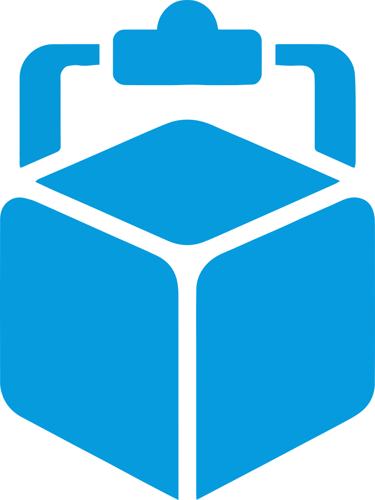

# Boxy

<p align="center">
  
</p>

<p align="center"><strong>Your snippets, offline first.</strong></p>

<p align="center">
  <a href="https://boxy.sadid.my.id">boxy.sadid.my.id</a>
</p>

Boxy keeps the text you paste more than once: replies, commands, templates with variables, small tables with formulas.
Everything is stored on your device (IndexedDB) and works without a network. Cloud storage and team features are
opt-in and planned in later phases (see `docs/`).

## What you get

- **Boxes, Tabs and Cards.** A Box holds Tabs, a Tab holds Cards. The rail on the left switches Boxes, the strip on top switches Tabs.
- **Two Card types today: text (Markdown) and table.** Tables have typed columns (text, number, date, time) and footer formulas such as `sum//all`, `avg//3`, `dur//all`, `cnt//all`, `first//1`, `last//1`.
- **Variables.** Write `{{name}}` in a Card. Boxy asks for the value when you copy and remembers the last value per Card. Built-ins: `{{date}}`, `{{date+3|fmt:dddd, D MMMM}}`, `{{time}}`, `{{datetime}}`, `{{weekday}}`, `{{month}}`, `{{year}}`, `{{uuid}}`, `{{random}}`, `{{timestamp}}`, `{{clipboard}}`, `{{global:key}}`, `{{counter:name}}`, defaults (`{{x|default:y}}`) and choices (`{{tone|choice:formal,casual}}`). Dates use your local time zone.
- **Copy as** plain text, Markdown, HTML, CSV, TSV or a Markdown table.
- **Quick Bar.** Put up to nine Cards in slots and copy them with `Alt+1..9` from anywhere in Boxy.
- **Palette** (`Ctrl+K`): search across all Boxes, run commands with `>`, jump to tags with `#`, to Boxes with `@`.
- **Keyboard first.** Arrow keys move between Cards, `Enter` opens, `C` copies, `Delete` moves to Trash, `Ctrl+V` on the grid creates a Card from the clipboard, `Ctrl+Z` undoes, `?` lists every shortcut.
- **Grid, list and masonry** views, pin, six colour labels, tags, sort and filter.
- **Trash** keeps deleted Boxes, Tabs and Cards for 30 days. **Undo** covers edits, moves and reorders.
- **Backups.** Export everything or one Box as JSON. A snapshot is stored locally once a day (last seven are kept). Import merges or replaces, and downloads a backup before replacing.
- **Moving from the previous Boxy.** Open the old site and choose "Move to the new Boxy", or import its export file. Tables that lived inside text Cards become Table Cards.
- **PWA.** Installable, offline, update banner instead of a blocking dialog. No telemetry, no account.
- **English and Indonesian**, following the browser (changeable in Settings).

## Run it locally

Requirements: Node 20 or newer, npm.

```bash
npm ci
npm run dev        # http://localhost:5173
```

Other scripts:

| Script | What it does |
|---|---|
| `npm run build` | Regenerates brand assets, typechecks, builds to `dist/` with the service worker |
| `npm run preview` | Serves `dist/` on port 4173 |
| `npm run typecheck` | `tsc --noEmit` |
| `npm run lint` | ESLint (with the Boxy guardrail plugin) and the copy linter |
| `npm test` | Vitest unit and integration tests (engines, repositories, legacy import, regressions) |
| `npm run e2e` | Builds with a second local origin allowed for handoff, then runs Playwright (desktop, mobile, two-origin handoff) |
| `npm run check` | typecheck, lint, test, build |
| `npm run brand` | Tokens from `brand/tokens.json`, logo recolour with geometry verification, PWA icons |

The first Playwright run needs `npx playwright install chromium`.

## Project layout

```
brand/            tokens.json (single source of colour), logo sources, fonts
docs/             glossary, ADRs, regression table, legacy fixtures used by tests
e2e/              Playwright specs and the stand-in for the previous Boxy (handoff)
scripts/          brand pipeline, copy linter, legacy fixture generator
src/app/          settings, UI state, actions, backup, PWA glue
src/components/   shell, cards, editor, palette, import, dialogs, primitives
src/content/      Starter Packs (EN and ID)
src/core/         template, formula, markdown, copy, search engines (pure, tested)
src/data/         Dexie schema, Yjs documents, repositories, import and export
src/i18n/         en.json, id.json
src/pages/        routed pages
tools/            ESLint plugin with the guardrails
```

## Data model in short

Each Box is a Yjs document persisted in IndexedDB; Dexie tables `boxes` and `cards_index` are projections used for
lists and search. Exports are JSON with `_meta.format = 2` and a SHA-256 checksum. See `docs/adr/` for the reasoning.

## Deploy

The site is served by Vercel from this repository (`vercel.json` holds headers, CSP and rewrites). GitHub Actions
runs typecheck, lint, tests and the build on every push and pull request; it does not deploy.

## Contributing

Before opening a pull request run `npm run check`. Copy rules (no em dashes, no emoji, glossary terms, no version
labels in the product) are enforced by `npm run lint`; the reasons are in `docs/glossary.md` and `docs/adr/`.

## License

MIT. See `LICENSE`.
